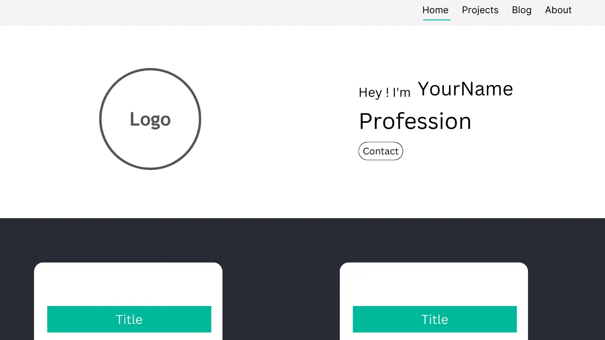

<h1>Personal Website</h1>

Welcome to my <a href="https://askaf11.github.io/Personal-Website/">Personal Website</a> repository! This project showcases my portfolio, blog, resume, and other personal interests. It serves as a hub for my professional online presence and a space to share my thoughts and projects with the world.

<h2>Features</h2>
<ul>
  <li align="justify"><b>Homepage: </b>A brief introduction and highlights of my skills and interests.</li>
  <li align="justify"><b>Portfolio: </b>Showcases my projects, including descriptions, technologies used, and links to live demos or repositories.</li>
  <li align="justify"><b>Blog: </b>Contains articles on topics I'm passionate about, including technology, personal development, and more.</li>
  <li align="justify"><b>Resume: </b>An interactive and downloadable version of my resume.</li>
  <li align="justify"><b>Contact: </b>A contact form and links to my social media profiles.</li>
</ul>

<h2>Technologies Used</h2>
<ul>
  <li align="justify"><b>HTML5:</b> For structuring the content on the web.</li>
  <li align="justify"><b>CSS3:</b> For styling and enhancing the appearance of the website.</li>
  <li align="justify"><b>Bootstrap 5:</b> For responsive layout and pre-designed components.</li>
</ul>
  
<h4 align="center">Personal Website Project | Created by <a href="https://askaf.in/" target="_blank">Askaf</a></h4>

